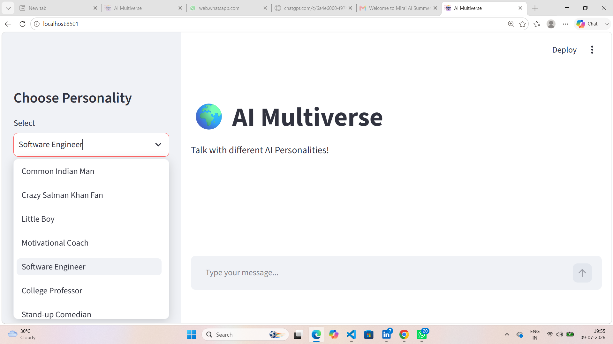
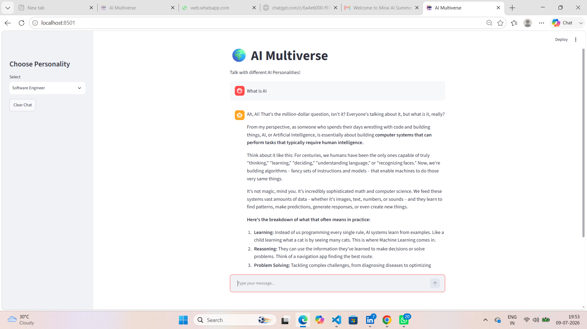

 # MirAI School of Technology - Virtual Summer Internship 2026

## Assignment 1

This repository contains my Streamlit projects completed as part of the MirAI School of Technology Virtual Summer Internship 2026.

### Projects Included
- The Identity Echo Interface (app1.py)
- Basic Calculator using Streamlit (calculator.py)

### Technologies Used
- Python
- Streamlit

## Assignment 2
### AI Multiverse Chatbot

#### Features
- Multiple AI Personalities
- Chat with Gemini AI
- Streamlit User Interface
- Clear Chat Option

#### Technologies Used
- Python
- Streamlit
- Google Gemini API
- python-dotenv

## Project Screenshots

### Home Screen

### Chat Example

## Assignment 3

### AI Multiverse Chatbot (Enhanced)

##### Features

- Multiple AI Personalities
- Chat Memory
- Streamlit Chat Interface
- Clear Chat Option

##### Technologies Used

- Python
- Streamlit
- Google Gemini API
- python-dotenv

## Project Demo

### Demo Video

[🎥 Assignment 3 Demo](https://drive.google.com/file/d/1LrrOvlVIJZK4T5K2gsiLk_sab2KkvdIa/view?usp=drivesdk)

# 🎨 AI Image Studio - Assignment 4

## 📌 Project Overview
AI Image Studio is a Streamlit-based web application that generates AI-powered images from text prompts using the Pollinations AI API. This upgraded version includes enhanced user experience features and customizable image generation settings.

## ✨ Features
- 🎨 Multiple Art Styles
- 📏 Custom Image Width & Height
- ✨ Magic Enhance Option
- 🎲 Surprise Me Feature
- 📥 Download Generated Images (.png)
- 🖼️ Interactive and User-Friendly Interface

## 🛠️ Tech Stack
- Python
- Streamlit
- Requests
- Pollinations AI API

## ▶️ How to Use
1. Launch the Streamlit application.
2. Choose your preferred art style.
3. Adjust the image width and height.
4. Enter an image prompt or click **🎲 Surprise Me!**
5. (Optional) Enable **✨ Magic Enhance** for better-quality images.
6. Click **Generate Image**.
7. Download the generated image as a PNG file.

## 📂 Project Files
- app.py
- requirements.txt
- README.md

## 👩‍💻 Developed By
**Riya Mishra**

## 🎥 Demo Video
Google Drive Link:
https://drive.google.com/file/d/1iec05dp--QjwgW2BaiXmsn6W6ote2oV1/view?usp=drivesdk

# Assignment 5 – AI Multi-Modal Visual Novel

## 📌 Overview
An interactive AI-powered visual storytelling application that combines text, AI-generated images, and audio narration to deliver an immersive storytelling experience.

## ✨ Features

- 🧠 **Narrative Logic:** Powered by **Llama 3.1** via **Groq API** to generate dynamic branching storylines and structured JSON choices.
- 🎨 **Dynamic Visuals:** Integrated with **Pollinations AI** to generate high-quality scene images in real time.
- 🔊 **Audio Integration:** Uses **gTTS (Google Text-to-Speech)** for immersive voice narration.
- 💻 **Interactive Frontend:** Built with **Streamlit** for a clean and user-friendly interface.

## 🛠️ Tech Stack

- Python
- Streamlit
- Groq API (Llama 3.1)
- Pollinations AI
- gTTS

## 🎯 Learning Outcomes

- AI API Integration
- Prompt Engineering
- JSON Parsing
- Dynamic UI Development
- Interactive Storytelling

---

⭐ **Developed as part of my internship at MirAI School of Technology.**
