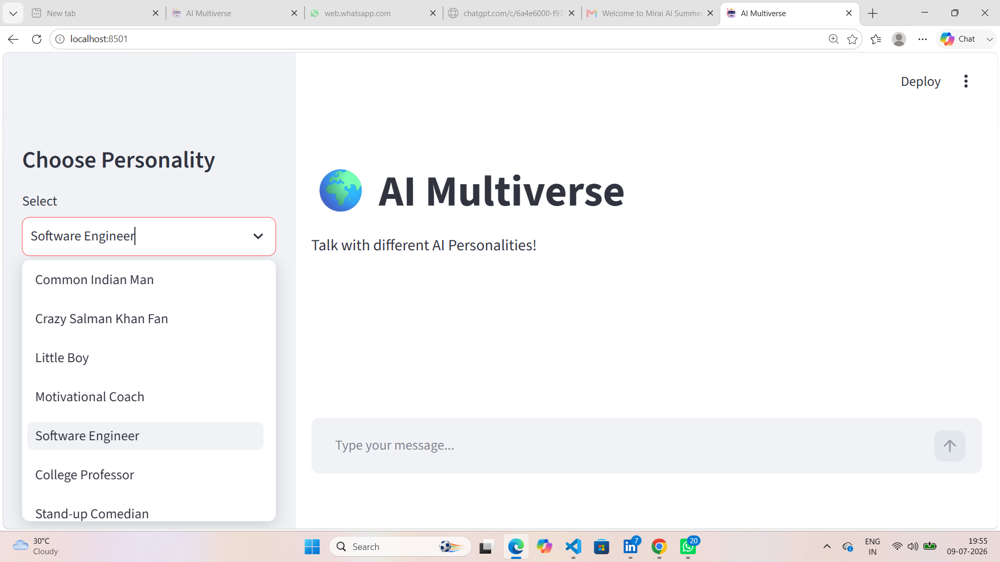
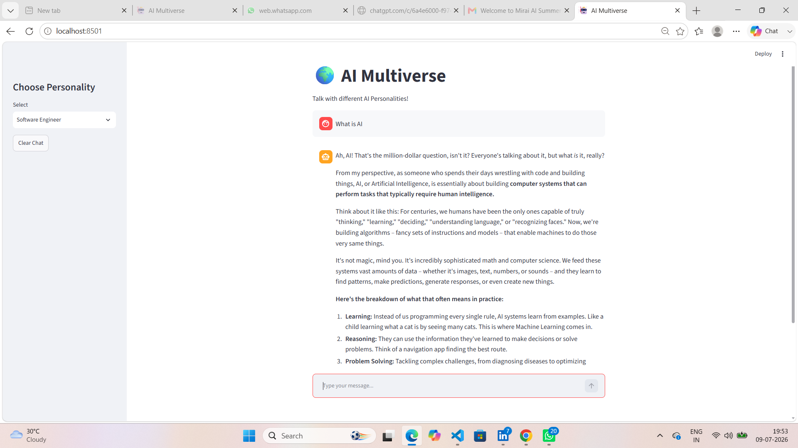

 # MirAI School of Technology - Virtual Summer Internship 2026

## Assignment 1

This repository contains my Streamlit projects completed as part of the MirAI School of Technology Virtual Summer Internship 2026.

### Projects Included
- The Identity Echo Interface (app1.py)
- Basic Calculator using Streamlit (calculator.py)

### Technologies Used
- Python
- Streamlit

## Assignment 2
### AI Multiverse Chatbot

#### Features
- Multiple AI Personalities
- Chat with Gemini AI
- Streamlit User Interface
- Clear Chat Option

#### Technologies Used
- Python
- Streamlit
- Google Gemini API
- python-dotenv

## Project Screenshots

### Home Screen


### Chat Example


## Assignment 3

### AI Multiverse Chatbot (Enhanced)

##### Features

- Multiple AI Personalities
- Chat Memory
- Streamlit Chat Interface
- Clear Chat Option

##### Technologies Used

- Python
- Streamlit
- Google Gemini API
- python-dotenv

## Project Demo

### Demo Video

[🎥 Assignment 3 Demo](https://drive.google.com/file/d/1LrrOvlVIJZK4T5K2gsiLk_sab2KkvdIa/view?usp=drivesdk)

# 🎨 AI Image Studio - Assignment 4

## 📌 Project Overview
AI Image Studio is a Streamlit-based web application that generates AI-powered images from text prompts using the Pollinations AI API. This upgraded version includes enhanced user experience features and customizable image generation settings.

## ✨ Features
- 🎨 Multiple Art Styles
- 📏 Custom Image Width & Height
- ✨ Magic Enhance Option
- 🎲 Surprise Me Feature
- 📥 Download Generated Images (.png)
- 🖼️ Interactive and User-Friendly Interface

## 🛠️ Tech Stack
- Python
- Streamlit
- Requests
- Pollinations AI API

## ▶️ How to Use
1. Launch the Streamlit application.
2. Choose your preferred art style.
3. Adjust the image width and height.
4. Enter an image prompt or click **🎲 Surprise Me!**
5. (Optional) Enable **✨ Magic Enhance** for better-quality images.
6. Click **Generate Image**.
7. Download the generated image as a PNG file.

## 📂 Project Files
- app.py
- requirements.txt
- README.md

## 👩‍💻 Developed By
**Riya Mishra**

## 🎥 Demo Video
Google Drive Link:
https://drive.google.com/file/d/1iec05dp--QjwgW2BaiXmsn6W6ote2oV1/view?usp=drivesdk

# Assignment 5 – AI Multi-Modal Visual Novel

## 📌 Overview
An interactive AI-powered visual storytelling application that combines text, AI-generated images, and audio narration to deliver an immersive storytelling experience.

## ✨ Features

- 🧠 **Narrative Logic:** Powered by **Llama 3.1** via **Groq API** to generate dynamic branching storylines and structured JSON choices.
- 🎨 **Dynamic Visuals:** Integrated with **Pollinations AI** to generate high-quality scene images in real time.
- 🔊 **Audio Integration:** Uses **gTTS (Google Text-to-Speech)** for immersive voice narration.
- 💻 **Interactive Frontend:** Built with **Streamlit** for a clean and user-friendly interface.

## 🛠️ Tech Stack

- Python
- Streamlit
- Groq API (Llama 3.1)
- Pollinations AI
- gTTS

## 🎯 Learning Outcomes

- AI API Integration
- Prompt Engineering
- JSON Parsing
- Dynamic UI Development
- ## 🎥 Project Demo

Watch the complete demo of the **AI Multi-Modal Visual Novel** on LinkedIn:

🔗 **LinkedIn Demo:**  
https://www.linkedin.com/posts/riya-mishra-b479b6343_artificialintelligence-generativeai-llama3-ugcPost-7485757478698184705-uPZc/

The demo showcases the application's AI-powered branching storylines, dynamic image generation, text-to-speech narration, and interactive Streamlit interface.

⭐ **Developed as part of Assignment 5 during my internship at MirAI School of Technology.**
## 🎓 Assignment 6: Hacker-Style Terminal GitHub Profile

### Software & AI Development Student | B.Tech CSE 🚀

```text
       /\_/\
      ( o.o )
       > ^ <
      ||||||

Name: ......... Riya Mishra
Role: ......... B.Tech CSE Student
University: ... AKTU
Track: ........ MirAI AI Builder Summer Intern '26
Kernel: ....... Software Engg & AI Development
OS: ........... Windows 11
Languages: .... Java, Python, JavaScript, HTML, CSS
Interests: .... Web Apps, Software Engineering, AI Tools
Learning: ..... Full Stack Web Dev & Machine Learning
Location: ..... Uttar Pradesh, India
Contact: ...... misra7060@gmail.com


# 🧠 Life-OS: AI Digital Wellbeing Coach

> **MirAI Virtual Summer Internship 2026 – Assignment 7**
>
> Track your daily screen time, analyze productivity, and receive personalized AI-powered coaching using Google Gemini.

---

## 🌐 Live Demo

**🔗 Streamlit App:**  
https://mirai-summer-internship-2026-qub5cqrzypks4vhqmoaydj.streamlit.app

---

## 📂 GitHub Repository

**📁 Assignment-7:**  
https://github.com/misra7060-ux/MirAI-Summer-Internship-2026/tree/main/Assignment-7

**📦 Main Internship Repository:**  
https://github.com/misra7060-ux/MirAI-Summer-Internship-2026

**👤 GitHub Profile:**  
https://github.com/misra7060-ux

---

## 📖 Project Overview

Life-OS is an AI-powered Digital Wellbeing Dashboard built using **Python**, **Streamlit**, **Pandas**, and **Google Gemini AI**. It helps users analyze their screen-time habits through interactive charts and provides AI-powered productivity coaching with practical suggestions.

---

## ✨ Features

### 📊 Screen Time Analytics
- Displays total screen time.
- Identifies the most-used application.
- Shows productive and non-productive usage.

### 📈 Interactive Visualizations
- Category-wise usage chart.
- Daily screen-time trend.
- Easy-to-understand dashboard.

### 🤖 Gemini AI Productivity Coach
- Reality Check
- Fun Productivity Roast
- Personalized Productivity Score
- Actionable tips for tomorrow

### ⚙️ Sidebar Filters
- Date range selection
- Category filter
- Interactive dashboard updates

---

## 🛠️ Tech Stack

- Python
- Streamlit
- Pandas
- Google Gemini API (`google-genai`)
- Streamlit Community Cloud

---

## 📂 Project Structure

```text
Assignment-7/
├── app.py
├── screentime.csv
├── requirements.txt
└── README.md
```

---

## 🚀 Installation

Clone the repository:

```bash
git clone https://github.com/misra7060-ux/MirAI-Summer-Internship-2026.git
```

Go to the project folder:

```bash
cd MirAI-Summer-Internship-2026/Assignment-7
```

Install dependencies:

```bash
pip install -r requirements.txt
```

Run the app:

```bash
streamlit run app.py
```

---

## 📦 Requirements

```text
streamlit
pandas
google-genai
plotly
```

---

## 🎯 Learning Outcomes

- Built interactive dashboards using Streamlit.
- Analyzed data with Pandas.
- Integrated Google Gemini API.
- Improved prompt engineering skills.
- Deployed the application on Streamlit Community Cloud.

---

## 👩‍💻 Developed By

**Riya Mishra**

B.Tech Computer Science & Engineering Student

Python Developer | Web Developer | AI Enthusiast

GitHub: https://github.com/misra7060-ux

---

## 🙏 Acknowledgements

Developed as part of the **MirAI Virtual Summer Internship 2026 – Assignment 7** using Streamlit and Google Gemini AI.


